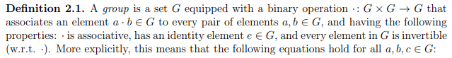
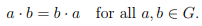
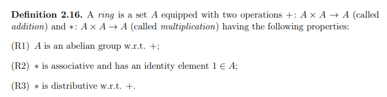
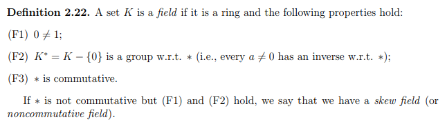

# Algebra, Topology, Differential Calculus, and Optimization Theory for Computer Science and Machine Learning 
### Jean Gallier and Jocelyn Quaintance
Contains important notes/definitions/propositions from the book **Algebra, Topology, Differential Calculus, and Optimization Theory for Computer Science and Machine Learning Jean Gallier and Jocelyn Quaintance.**
The book can be found [here.](https://www.cis.upenn.edu/~jean/gbooks/geomath.html)

# Table of contents

- [Introduction](#Ch1)
- [Groups, Rings, and Fields](#Ch2)
- [Vector Spaces, Bases, Linear Maps](#Ch3)
- [Matrices and Linear Maps](#Ch4)
- [Haar Bases, Haar Wavelets, Hadamard Matrices](#Ch5)
- [Direct Sums](#Ch6)
- [Determinants](#Ch7)
- [Gaussian Elimination, LU, Cholesky, Echelon Form](#Ch8)
- [Vector Norms and Matrix Norms](#Ch9)
- [Iterative Methods for Solving Linear Systems](#Ch10)
- [The Dual Space and Duality](#Ch11)
- [Euclidean Spaces](#Ch12)
- [QR-Decomposition for Arbitrary Matrices](#Ch13)
- [Hermitian Spaces](#Ch14)
- [Eigenvectors and Eigenvalues](#Ch15)
- [Unit Quaternions and Rotations in SO(3)](#Ch16)
- [Spectral Theorems](#Ch17)
- [Computing Eigenvalues and Eigenvectors](#Ch18)
- [Introduction to The Finite Elements Method](#Ch19)
- [Graphs and Graph Laplacians; Basic Facts](#Ch20)
- [Spectral Graph Drawing](#Ch21)
- [Singular Value Decomposition and Polar Form](#Ch22)
- [Applications of SVD and Pseudo-Inverses](#Ch23)
- [Basics of Affine Geometry](#Ch24)
- [Embedding an Affine Space in a Vector Space](#Ch25)
- [Basics of Projective Geometry](#Ch26)
- [The Cartan–Dieudonn´e Theorem](#Ch27)
- [Isometries of Hermitian Spaces](#Ch28)
- [The Geometry of Bilinear Forms; Witt’s Theorem](#Ch29)
- [Polynomials, Ideals and PID’s](#Ch30)
- [Annihilating Polynomials; Primary Decomposition](#Ch31)
- [UFD’s, Noetherian Rings, Hilbert’s Basis Theorem](#Ch32)
- [Tensor Algebras](#Ch33)
- [Exterior Tensor Powers and Exterior Algebras](#Ch34)
- [Introduction to Modules; Modules over a PID](#Ch35)
- [Normal Forms; The Rational Canonical Form](#Ch36)
- [Topology](#Ch37)
- [A Detour On Fractals](#Ch38)
- [Differential Calculus](#Ch39)
- [Extrema of Real-Valued Functions](#Ch40)
- [Newton’s Method and Its Generalizations](#Ch41)
- [Quadratic Optimization Problems](#Ch42)
- [Schur Complements and Applications](#Ch43)
- [Convex Sets, Cones, H-Polyhedra](#Ch44)
- [Linear Programs](#Ch45)
- [The Simplex Algorithm](#Ch46)
- [Linear Programming and Duality](#Ch47)
- [Basics of Hilbert Spaces](#Ch48)
- [General Results of Optimization Theory](#Ch49)
- [Introduction to Nonlinear Optimization](#Ch50)
- [Subgradients and Subdifferentials](#Ch51)
- [Dual Ascent Methods; ADMM](#Ch52)
- [Ridge Regression and Lasso Regression](#Ch53)
- [Positive Definite Kernels](#Ch54)
- [Soft Margin Support Vector Machines](#Ch55)
- [Total Orthogonal Families in Hilbert Spaces](#Ch56)
- [Zorn’s Lemma; Some Applications](#Ch57)

### Introduction 

These are just meant to be notes for personal use, you may find them useful. I have very limited background in mathematics, so there may be mistakes here. 
You will most definitely need to keep the book open on the side as this mentions specific definitions/propositions by reference for brevity. 

I may give up on this endeavor at any moment I find better ways to condense knowledge for myself. 

### Groups, Rings, and Fields 

**Abelian**:
A group G is *abelian* (or commutative) if:

**Monoid**:
Set M with operation MxM -> M and element 'e' satisfying (G1) and (G2) is a monoid. Not necessarily a group.

**General Linear Group GL(n, R) or GL(n, C)** : 
1. N x N Invertible with Real/Complex Coefficients
2. Group under MatMul
3. Identity element In

**Special Linear Group SL(n, R) or GL(n, R)**:
1. Sub-group of GL with det(matrix) = 1

**Orthogonal Group O(n)**:
1. Set of N x N invertible matrices (Q) with real coefficients 
2. QQ' = Q'Q = In

**Special Orthogonal Group SO(n)**:
1. Sub-group of O(n) with Det(Q) = 1

**Proposition 2.7:** For finite group G, subgroup H of G, orcer of H divides order of G.

**Rings**

**Fields**

### Vector Spaces, Bases, Linear Maps 

### Matrices and Linear Maps 

### Haar Bases, Haar Wavelets, Hadamard Matrices 

### Direct Sums 

### Determinants 

### Gaussian Elimination, LU, Cholesky, Echelon Form 

### Vector Norms and Matrix Norms 

### Iterative Methods for Solving Linear Systems 

### The Dual Space and Duality 

### Euclidean Spaces 

### QR-Decomposition for Arbitrary Matrices 

### Hermitian Spaces 

### Eigenvectors and Eigenvalues 

### Unit Quaternions and Rotations in SO(3 

### Spectral Theorems 

### Computing Eigenvalues and Eigenvectors 

### Introduction to The Finite Elements Method 

### Graphs and Graph Laplacians; Basic Facts 

### Spectral Graph Drawing 

### Singular Value Decomposition and Polar Form 

### Applications of SVD and Pseudo-Inverses 

### Basics of Affine Geometry 

### Embedding an Affine Space in a Vector Space 

### Basics of Projective Geometry 

### The Cartan–Dieudonn´e Theorem 

### Isometries of Hermitian Spaces 

### The Geometry of Bilinear Forms; Witt’s Theorem 

### Polynomials, Ideals and PID’s 

### Annihilating Polynomials; Primary Decomposition 

### UFD’s, Noetherian Rings, Hilbert’s Basis Theorem 

### Tensor Algebras 

### Exterior Tensor Powers and Exterior Algebras 

### Introduction to Modules; Modules over a PID 

### Normal Forms; The Rational Canonical Form 

### Topology 

### A Detour On Fractals 

### Differential Calculus 

### Extrema of Real-Valued Functions 

### Newton’s Method and Its Generalizations 

### Quadratic Optimization Problems 

### Schur Complements and Applications 

### Convex Sets, Cones, H-Polyhedra 

### Linear Programs 

### The Simplex Algorithm 

### Linear Programming and Duality 

### Basics of Hilbert Spaces 

### General Results of Optimization Theory 

### Introduction to Nonlinear Optimization 

### Subgradients and Subdifferentials 

### Dual Ascent Methods; ADMM 

### Ridge Regression and Lasso Regression 

### Positive Definite Kernels 

### Soft Margin Support Vector Machines 

### Total Orthogonal Families in Hilbert Spaces 

### Zorn’s Lemma; Some Applications 

